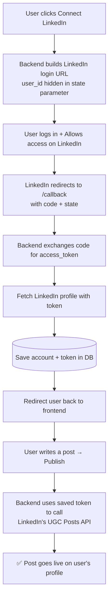

<div align="center">

# 🔗 LinkedIn Integration Module

### ScaleOn — Social Media Automation Tool (Backend)
**LinkedIn OAuth + Auto-Posting Backend Service**

A FastAPI backend that connects any user's LinkedIn account via OAuth 2.0, lets them publish text and image posts directly from a web app, and is fully containerized with Docker for consistent team-wide deployment.

[](https://www.python.org/)
[](https://fastapi.tiangolo.com/)
[](https://www.docker.com/)
[](https://www.linkedin.com/developers/)
[]()

</div>

---

## 📌 Problem Statement

Manually logging into LinkedIn every time to post an update is repetitive and doesn't scale — especially for a tool meant to manage social media presence for multiple users. This module gives a backend service the ability to authenticate on a user's behalf (via LinkedIn's official OAuth 2.0 flow) and publish content directly to their profile, without ever handling their password.

This is the **LinkedIn integration piece** of a larger **Social Media Automation Tool** — scheduling/auto-posting at a future time is being built as a separate module by another teammate on top of this backend.

## ✨ Features

| Feature | Description |
|---|---|
| 🔐 **OAuth 2.0 Login** | Secure "Connect LinkedIn" flow — user logs in on LinkedIn's own page, never shares credentials with us |
| 👤 **Profile Fetch** | Pulls connected user's name, email, and profile picture |
| 📝 **Text Post** | Publish a text update directly to the user's LinkedIn feed |
| 🖼️ **Image Post** | Publish a post with an attached image (upload → register → post) |
| ❌ **Disconnect** | Cleanly remove a user's saved LinkedIn account/token |
| 🔄 **Auto-Redirect** | After login, user is redirected straight back to the frontend — no manual copy-pasting of codes |
| 🐳 **Dockerized** | Fully containerized so every team member runs an identical environment |
| 🧪 **Demo Frontend** | A lightweight `demo.html` to test every endpoint without touching Swagger |

> ⚠️ **Note:** LinkedIn Analytics and Articles publishing require special partner-level API access that isn't available on a standard developer account — these endpoints correctly return a "not supported" response rather than failing silently.

## 🧭 How It Works — OAuth Flow



## 🏗️ Tech Stack

- **Framework:** FastAPI (Python)
- **Server:** Uvicorn (ASGI)
- **HTTP Client:** httpx (async calls to LinkedIn's API)
- **Database:** SQLAlchemy ORM (SQLite for local/dev testing)
- **Auth:** LinkedIn OAuth 2.0 (Authorization Code flow with `state` parameter for user tracking)
- **Config:** python-dotenv (secrets loaded from `.env`, never hardcoded)
- **File Uploads:** python-multipart (for image posts)
- **Containerization:** Docker
- **Testing UI:** Plain HTML + JavaScript (`demo.html`) served via VS Code Live Server

## 📂 Project Structure

```
backend/
├── app/
│   ├── main.py                     # App entry point, CORS setup, router registration
│   ├── database.py                 # DB engine/session setup
│   ├── core/
│   │   └── config.py                # Loads all settings from .env
│   └── integrations/
│       └── linkedin/
│           ├── router.py             # API endpoints (/connect, /callback, /post, etc.)
│           ├── service.py             # Business logic layer
│           ├── oauth.py               # Login URL building + token exchange orchestration
│           ├── client.py               # Raw HTTP calls to LinkedIn's API
│           ├── models.py               # LinkedInAccount DB table
│           ├── schemas.py               # Request/response data shapes
│           └── exceptions.py             # Custom error types
├── demo.html                       # Standalone test frontend (no Swagger needed)
├── Dockerfile                      # Container build instructions
├── .dockerignore
├── .gitignore
├── requirements.txt
└── .env                            # Secrets (NOT committed to Git)
```

## 🔌 API Endpoints

| Method | Endpoint | Description |
|---|---|---|
| `GET` | `/api/linkedin/connect` | Generates LinkedIn login URL for a given `user_id` |
| `GET` | `/api/linkedin/callback` | Handles LinkedIn's redirect, exchanges code for token, saves account |
| `GET` | `/api/linkedin/profile` | Returns connected user's LinkedIn profile info |
| `POST` | `/api/linkedin/post` | Publishes a text post |
| `POST` | `/api/linkedin/post-image` | Publishes a post with an image |
| `DELETE` | `/api/linkedin/disconnect` | Disconnects the user's LinkedIn account |
| `GET` | `/api/linkedin/analytics` | Returns "not supported" (requires LinkedIn partner access) |
| `GET` | `/api/linkedin/articles` | Returns "not supported" (requires LinkedIn partner access) |

## 🚀 Getting Started

### 1. Clone the repo
```bash
git clone https://github.com/nitishchauhan002/linkedin-integration-module.git
cd linkedin-integration-module/backend
```

### 2. Configure environment variables
Create a `.env` file in the `backend/` folder:

```env
LINKEDIN_CLIENT_ID=your_linkedin_client_id
LINKEDIN_CLIENT_SECRET=your_linkedin_client_secret
LINKEDIN_REDIRECT_URI=http://localhost:8000/api/linkedin/callback
FRONTEND_URL=http://127.0.0.1:5500/demo.html
```

> Get `client_id` / `client_secret` from the [LinkedIn Developer Portal](https://www.linkedin.com/developers/apps) — make sure the **Authorized redirect URL** there exactly matches `LINKEDIN_REDIRECT_URI` above, and that **Sign In with LinkedIn using OpenID Connect** + **Share on LinkedIn** products are added to your app.

### 3. Run with Docker (recommended — matches team setup)

```bash
docker build -t linkedin-backend .
docker run -p 8000:8000 --env-file .env linkedin-backend
```

### OR run locally without Docker

```bash
python -m venv venv
venv\Scripts\activate        # Windows
pip install -r requirements.txt
uvicorn app.main:app --reload
```

Backend will be live at **http://localhost:8000**

### 4. Test it with the demo page

Open `demo.html` with VS Code's **Live Server** extension (right-click → *Open with Live Server*). This gives a simple UI to:
- Connect LinkedIn
- View profile
- Publish a text post
- Publish an image post
- Disconnect

No Swagger/manual code-pasting required — everything works with button clicks.

## 🔒 Security Notes

- `.env` is git-ignored — client secret and tokens are never committed
- Password is never seen or stored by this backend — LinkedIn handles authentication entirely on its own login page (standard OAuth 2.0 behavior, same as Buffer/Hootsuite)
- The OAuth `state` parameter is used to safely map LinkedIn's callback back to the correct internal `user_id`

## 🔮 Future Improvements

- Scheduled/automated posting (in progress — separate module by teammate, built on top of this backend)
- Switch from SQLite to PostgreSQL for production (`psycopg2-binary` already included)
- Token refresh handling for long-lived scheduled posts
- Replace `user_id` query param with proper authenticated session (`Depends(get_current_user)`) once the main app's login system is ready
- `docker-compose.yml` to run backend + database together

## 👤 Author

**Nitish Kumar Singh**
🔗 [LinkedIn](https://www.linkedin.com/in/nitish-kumar-singh-4802792bb/) · [GitHub](https://github.com/nitishchauhan002)

---

<div align="center">
Built as part of the <b>ScaleOn Social Media Automation Tool</b>
</div>
